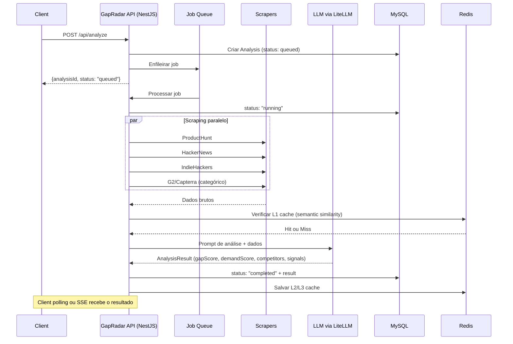
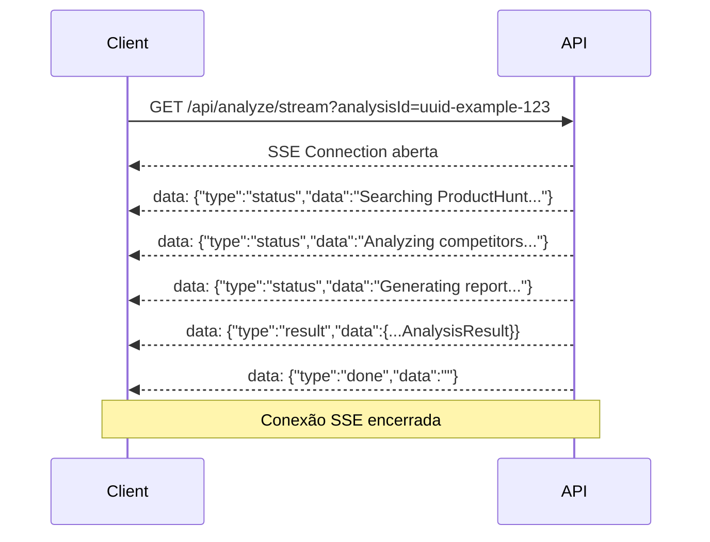

# Arquitetura — GapRadar

Visão geral da arquitetura do GapRadar para desenvolvedores que integram com a API ou entendem o fluxo de dados.

---

## Stack

| Camada | Tecnologia |
|--------|-----------|
| Backend | NestJS 11 + TypeScript |
| Frontend | React 18 + Vite (servido pelo próprio NestJS via `ServeStaticModule`) |
| Banco de dados | MySQL 8 via Prisma 6 |
| Cache | Redis |
| AI Gateway | LiteLLM (roteamento de modelos LLM) |
| Auth | JWT HS256 (bcrypt para senhas) |
| Pagamentos | Stripe |
| Infraestrutura | Docker + VPS |

---

## Diagrama de fluxo — Criação de análise



---

## Fluxo de streaming SSE



---

## Sistema de Cache (3 camadas)

O GapRadar usa três camadas de cache em Redis para reduzir latência e custo de LLM:

| Camada | Descrição | TTL |
|--------|-----------|-----|
| **L1 — Semantic Cache** | Cache por similaridade semântica da ideia. Ideias parecidas reusam resultado anterior sem novo scraping/LLM. | 24 horas |
| **L2 — Raw Scraping Cache** | Cache dos dados brutos coletados por fonte (ProductHunt, HN, etc.) para a mesma query. | 6 horas |
| **L3 — Market Memory** | Memória de mercado por categoria (software/physical/service). Contexto de mercado acumulado. | 7 dias |

---

## Fontes de dados

O sistema scrapa e analisa as seguintes fontes por categoria:

| Fonte | Tipo | Categoria |
|-------|------|-----------|
| ProductHunt | Lançamentos de produtos | Software |
| HackerNews | Discussões e Show HN | Software + Service |
| IndieHackers | Produtos indie e debates | Software + Service |
| G2 / Capterra | Avaliações B2B | Software |
| Amazon | Avaliações de produtos físicos | Physical |
| Etsy | Produtos artesanais e nicho | Physical |
| Trustpilot | Avaliações de serviços | Service |

> O roteamento categórico usa filtros `site:` via Firecrawl para G2/Capterra/Amazon/Etsy/Trustpilot.

---

## Módulos NestJS principais

```
src/
├── auth/          # AuthModule — JWT, bcrypt, guards
├── analysis/      # AnalysisModule — core, filas, scrapers
├── reports/       # ReportsModule — formatação, PDF export
├── billing/       # BillingModule — Stripe checkout + webhooks
├── users/         # UsersModule — perfil, usage stats
├── cache/         # RedisModule + CacheService (L1/L2/L3)
├── prisma/        # PrismaModule — conexão MySQL
└── app/           # ServeStaticModule — serve React/Vite build
```

---

## API dupla: REST + GraphQL

O GapRadar expõe dois endpoints de API:

- **REST**: `/api/*` — principais operações (criar análise, auth, billing)
- **GraphQL**: `POST /graphql` — queries flexíveis para leitura de dados

Ambos usam o mesmo Bearer JWT para autenticação.

---

## Modelo de segurança

- Senhas: **bcrypt** (salt rounds configurável)
- Tokens: **JWT HS256** com expiração
- Rotas públicas: marcadas explicitamente (sem guard)
- Rotas privadas: guarda JWT via `@UseGuards(JwtAuthGuard)` por padrão
- Billing webhooks: validados com assinatura Stripe (HMAC)

---

## Infraestrutura de produção

```
VPS (187.77.56.120)
  └── Docker Compose
        ├── gapradar-api      (porta 3100, network_mode: host)
        ├── gapradar-redis    (porta 6380)
        └── eventingon-mysql  (compartilhado, porta 3306)

Nginx
  └── gapradar.com.br → proxy_pass localhost:3100
```

> A API usa `network_mode: host` no Docker, por isso não usa mapeamento de portas — o processo se liga diretamente à interface do host na porta 3100.
